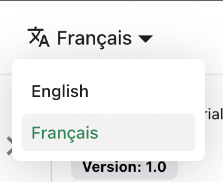

# 翻译您的站点

让我们把 `docs/intro.md` 翻译成法语。

## 配置国际化

修改 `docusaurus.config.js` 以添加对 `fr` 语言环境的支持：

```js title="docusaurus.config.js"
export default {
  i18n: {
    defaultLocale: 'en',
    locales: ['en', 'fr'],
  },
};
```

## 翻译文档

将 `docs/intro.md` 文件复制到 `i18n/fr` 文件夹：

```bash
mkdir -p i18n/fr/docusaurus-plugin-content-docs/current/

cp docs/intro.md i18n/fr/docusaurus-plugin-content-docs/current/intro.md
```

用法语翻译 `i18n/fr/docusaurus-plugin-content-docs/current/intro.md`。

## 启动本地化站点

使用法语语言环境启动您的站点：

```bash
npm run start -- --locale fr
```

您的本地化站点可以在 [http://localhost:3000/fr/](http://localhost:3000/fr/) 访问，"快速开始"页面已被翻译。

:::caution

在开发模式下，一次只能使用一个语言环境。

:::

## 添加语言环境下拉菜单

为了在不同语言之间无缝切换，添加语言环境下拉菜单。

修改 `docusaurus.config.js` 文件：

```js title="docusaurus.config.js"
export default {
  themeConfig: {
    navbar: {
      items: [
        // highlight-start
        {
          type: 'localeDropdown',
        },
        // highlight-end
      ],
    },
  },
};
```

语言环境下拉菜单现在会出现在您的导航栏中：



## 构建您的本地化站点

为特定语言环境构建您的站点：

```bash
npm run build -- --locale fr
```

或者一次性构建包含所有语言环境的站点：

```bash
npm run build
```
